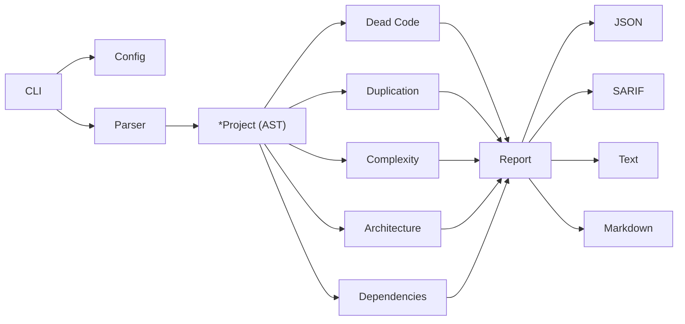

<div align="center">

# krait

**Unified codebase health analyzer for Go**

[](go.mod)
[](https://github.com/krait-go/krait/releases)
[](https://github.com/krait-go/krait/actions/workflows/ci.yml)
[](https://goreportcard.com/report/github.com/krait-go/krait)
[](https://pkg.go.dev/github.com/krait-go/krait)
[](LICENSE)

One binary. One command. Five analyses. Zero config required.

</div>

---

## The Problem

The Go ecosystem has no single tool that gives you a unified codebase health scan. Today, if you want comprehensive static analysis, you must cobble together five or more separate tools, each with its own output format, invocation, and CI integration:

| Analysis | Current Tools | Limitation |
|----------|--------------|------------|
| Dead code | deadcode | Functions only — no unused exports, types, vars, or consts across packages |
| Unused deps | go mod tidy | Partial — only catches completely unused modules |
| Duplication | jscpd | JS-based, slow, no Go AST awareness |
| Complexity | gocyclo, gocognit | Separate tools, separate reports, no unified threshold |
| Architecture | go-cleanarch | Config-heavy, no coupling metrics, no instability scores |

krait replaces all five with a single binary that produces one structured report — either human-readable text or machine-readable JSON, ready to feed directly into your AI tools or CI pipeline.

---

## Features

- Dead code detection — unused exported functions, types, variables, and constants across packages
- AST-based code duplication — catches semantic clones even when variables are renamed
- Cyclomatic and cognitive complexity scoring with configurable thresholds
- Architecture layer violation detection with coupling metrics
- Dependency hygiene — unused `go.mod` dependencies and unlisted imports
- AI-native JSON output structured for Claude Code and Cursor integration
- SARIF 2.1 support for GitHub Code Scanning upload
- Zero config — runs on any Go project with `krait check`, no setup required
- Per-rule severity overrides (`error`, `warning`, `off`) via `.krait.json`
- CI mode with threshold-based exit codes

---

## Quick Start

```bash
# Install
go install github.com/krait-go/krait/cmd/krait@latest

# Run on your project
krait check

# JSON output for AI tools
krait check -f json | claude "analyze this report"

# CI mode — exits 1 on any error-severity finding
krait check --ci
```

---

## Installation

**go install** (recommended)

```bash
go install github.com/krait-go/krait/cmd/krait@latest
```

**Homebrew**

```bash
brew install krait-go/tap/krait
```

**Binary releases**

Download the latest pre-built binary for your platform from the [GitHub releases page](https://github.com/krait-go/krait/releases).

**Docker**

```bash
docker pull ghcr.io/krait-go/krait:latest
docker run --rm -v $(pwd):/src ghcr.io/krait-go/krait:latest check /src
```

---

## Commands

| Command | Description |
|---------|-------------|
| `check` | Run all five analyzers (default command — runs even if you omit it) |
| `dead` | Dead code analysis only |
| `dupes` | Code duplication detection only |
| `complexity` | Complexity analysis only |
| `arch` | Architecture layer analysis only |
| `deps` | Dependency hygiene analysis only |
| `init` | Create a `.krait.json` config file with defaults |
| `version` | Print version and exit |

---

## Flags

All flags apply to every command.

| Flag | Short | Default | Description |
|------|-------|---------|-------------|
| `--format` | `-f` | `text` | Output format: `text`, `json`, `sarif`, `markdown` |
| `--dir` | `-d` | `.` | Project root directory to analyze |
| `--threshold` | `-t` | `0` | Exit 1 if total finding count exceeds N |
| `--tests` | | `false` | Include `_test.go` files in the analysis |
| `--ci` | | `false` | CI mode: JSON output, exit 1 on any `error`-severity finding |

A positional argument overrides `--dir`:

```bash
krait check ./path/to/project
```

---

## Output Formats

**text** (default) — human-readable, suitable for local development

```
krait v0.1.0 — 142ms

Found 7 issues (1 errors, 5 warnings, 1 info)

=== dead-code (3 findings, 12ms) ===

  [WRN] pkg/util/format.go:42: exported function FormatBytes is unused outside its package
  [WRN] pkg/util/format.go:61: exported type ByteUnit is unused outside its package
  [WRN] internal/metrics/counter.go:18: exported var DefaultBuckets is unused outside its package

=== complexity (2 findings, 8ms) ===

  [WRN] pkg/parser/parse.go:104: function ParseManifest has cyclomatic complexity 17 (threshold: 15)
  [ERR] pkg/pipeline/run.go:233: function executePipeline has cognitive complexity 24 (threshold: 20)
```

**json** — structured, machine-readable, AI-ready

```json
{
  "version": "0.1.0",
  "timestamp": "2026-05-09T10:00:00Z",
  "total_duration": "142ms",
  "summary": {
    "total_findings": 7,
    "by_severity": { "error": 1, "warning": 5, "info": 1 },
    "by_category": { "dead-code": 3, "complexity": 2, "dependency": 2 }
  },
  "results": [
    {
      "analyzer": "dead-code",
      "duration_ms": 12,
      "findings": [
        {
          "rule": "unused-export-func",
          "category": "dead-code",
          "severity": "warning",
          "message": "exported function FormatBytes is unused outside its package",
          "location": { "file": "pkg/util/format.go", "line": 42 }
        }
      ]
    }
  ]
}
```

**sarif** — SARIF 2.1 for GitHub Code Scanning

```bash
krait check -f sarif > results.sarif
# Then upload via actions/upload-sarif in your GitHub Actions workflow
```

**markdown** — suitable for PR comments or issue bodies

```bash
krait check -f markdown > report.md
```

---

## Configuration

Run `krait init` to create a `.krait.json` in your project root. krait also accepts `.krait.jsonc` and `krait.json`. Without a config file, all defaults apply.

```jsonc
{
  "$schema": "https://raw.githubusercontent.com/krait-go/krait/main/schema.json",

  "ignore_patterns": [
    "vendor/**",
    "**/testdata/**",
    "**/.git/**",
    "**/generated/**",
    "**/*.pb.go",
    "**/*_gen.go"
  ],

  "include_tests": false,

  "rules": {
    "unused-export-func":         "warning",
    "unused-export-method":       "warning",
    "unused-export-type":         "warning",
    "unused-export-var":          "warning",
    "unused-export-const":        "warning",
    "unused-dependency":          "warning",
    "unlisted-dependency":        "error",
    "high-cyclomatic-complexity": "warning",
    "high-cognitive-complexity":  "warning",
    "code-duplication":           "warning",
    "god-package":                "warning",
    "layer-violation":            "error"
  },

  "cyclomatic_threshold": 15,
  "cognitive_threshold": 20,

  "min_duplicate_lines": 6,
  "min_duplicate_tokens": 50,

  "architecture_layers": [
    {
      "name": "domain",
      "packages": ["**/domain/**", "**/entity/**", "**/model/**"],
      "can_import": []
    },
    {
      "name": "usecase",
      "packages": ["**/usecase/**", "**/service/**", "**/application/**"],
      "can_import": ["domain"]
    },
    {
      "name": "adapter",
      "packages": ["**/handler/**", "**/repository/**", "**/infra/**"],
      "can_import": ["domain", "usecase"]
    }
  ],

  "ignore_exports": ["New*", "Must*", "Register*"]
}
```

**Rule severities:**
- `"error"` — counts toward `--ci` exit-1, useful for hard violations (architecture, unlisted deps)
- `"warning"` — reported but does not fail CI by default
- `"off"` — rule is silenced entirely

---

## Architecture



The CLI layer parses flags and loads config, then delegates to `internal/parser` which builds the shared `*Project` (parsed ASTs for every file in scope). Each analyzer receives the same `*Project` and returns a `*Result` containing zero or more `Finding` values. The reporter layer formats the aggregate `Report` into the requested output format. No analyzer touches the filesystem directly — all file access is done once at parse time.

---

## Claude Code Integration

The primary design goal of krait's JSON output is to be consumed by AI coding assistants. krait does the exhaustive structural analysis; your AI tool does the reasoning.

```bash
# Step 1: Run krait
krait check -f json > .krait-report.json

# Step 2: Feed to Claude Code
claude "Read .krait-report.json. For the top 3 complexity hotspots,
       suggest specific refactoring strategies."
```

**Why this is better than asking Claude Code to analyze your code directly:**

When you ask an AI to find dead code or measure complexity in a large codebase, it works by sampling — it reads some files, makes inferences, and misses things outside its context window. krait is deterministic and exhaustive: it parses every file in your module, builds the full reference graph, and reports every violation. The AI then receives a compact structured report (not thousands of lines of source) and can reason about it with full attention.

Practical workflows:

```bash
# Find the worst complexity hotspots and ask for refactoring strategies
krait complexity -f json | claude "Rank these functions by refactoring effort.
  For the top 5, give me concrete restructuring suggestions."

# Review dead code before a major cleanup
krait dead -f json | claude "Which of these unused exports are safe to delete
  and which might be used by external consumers of this package?"

# Architecture review before a release
krait arch -f json | claude "Explain each layer violation in plain English
  and suggest the minimal fix for each."
```

---

## Contributing

See [CONTRIBUTING.md](CONTRIBUTING.md) for setup instructions, development workflow, and contribution guidelines.

---

## License

MIT — see [LICENSE](LICENSE).
